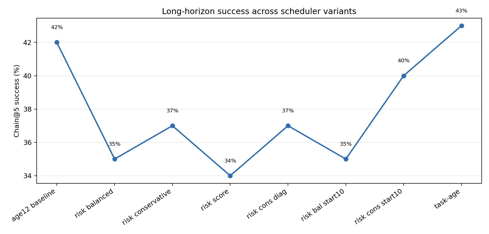
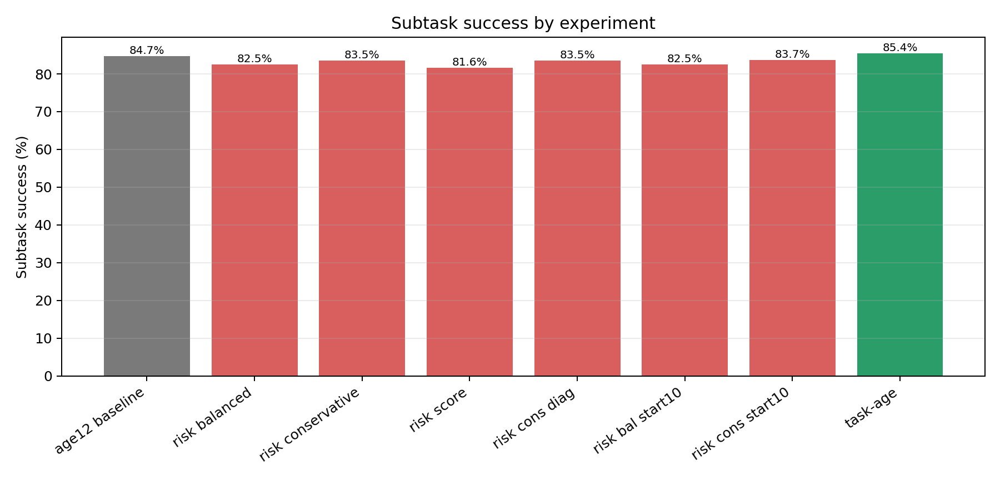
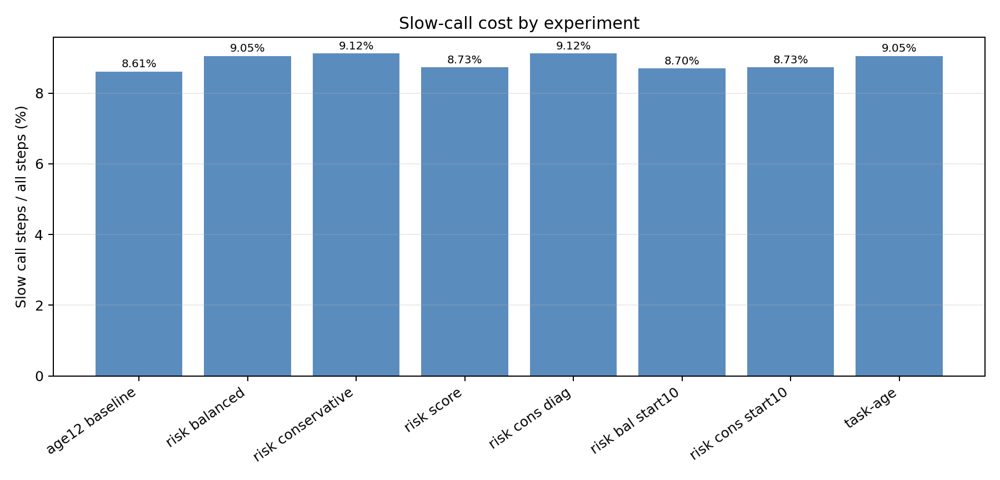
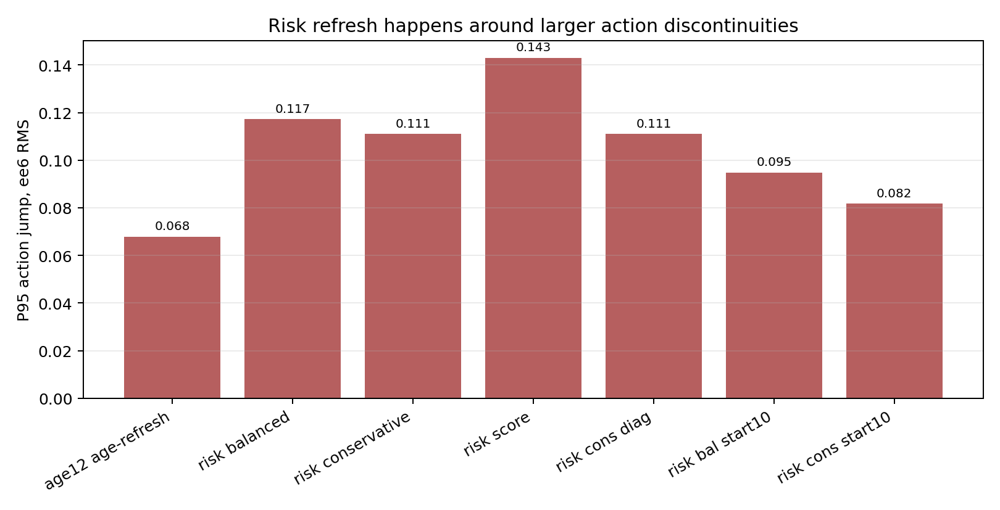
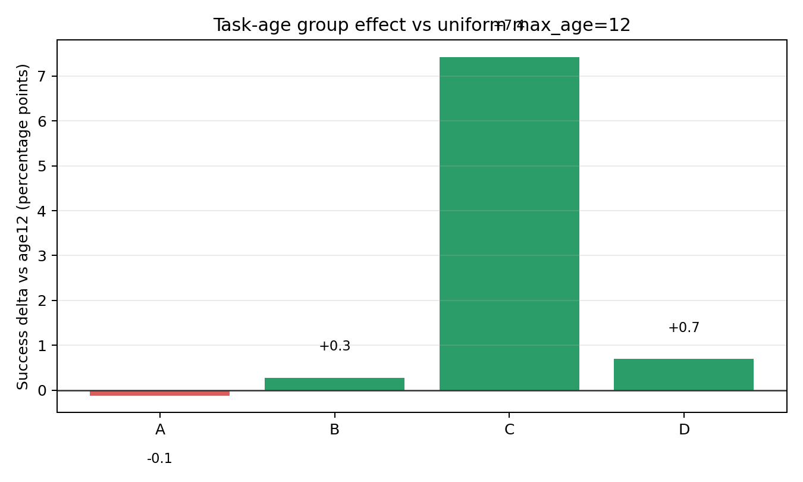
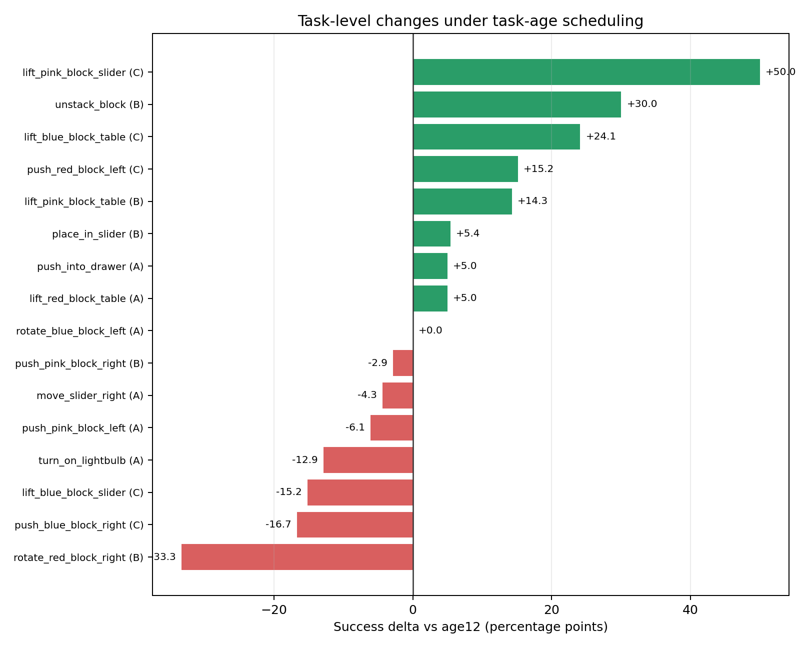

# 0526 组会报告：RoboDual 快慢系统调度实验

## 当前进度

本阶段最好的结果来自 `task_age`：

| 实验 | task success | avg seq len | chain@5 | slow rate | 说明 |
|---|---:|---:|---:|---:|---|
| age12 baseline | 84.74% | 3.22 | 42% | 8.61% | 统一 `max_slow_age=12` |
| risk conservative start10 | 83.74% | 3.09 | 40% | 8.73% | risk 延迟触发后有所恢复 |
| task-age | 85.42% | 3.34 | 43% | 9.05% | 按任务分组设置 age |



## 实验逻辑

RoboDual 中 slow generalist 每次输出 8 步指导动作和 hidden states，fast specialist 每步执行控制。原始逻辑接近固定 8 步刷新，耗时主要来自 slow model。因此实验目标是：

```text
减少 slow call 次数，同时尽量保持或提高任务成功率。
```

先前统一 age 实验发现：

- `max_slow_age=12` 能在明显降低 slow call 的同时保持较好成功率。
- `max_slow_age=16` 空指导比例过高，成功率明显下降。
- 说明 specialist 可以在一段时间内脱离 slow guidance，但不是无限稳定。



## 第一阶段：risk trigger 尝试

实验思路是让系统不要手动指定任务规则，而是根据在线风险指标自适应调用 slow model。使用的指标包括：

- `aggregation_delta_ee6`
- `jerk_l2_ee6`
- `gripper_flip_count`
- `sample_var_ee6`
- `sample_var_gripper`

测试了三类策略：

- `risk_balanced`
- `risk_conservative`
- `risk_score`

结果不理想：

| 实验 | task success | chain@5 | slow rate |
|---|---:|---:|---:|
| age12 baseline | 84.74% | 42% | 8.61% |
| risk balanced | 82.53% | 35% | 9.05% |
| risk conservative | 83.51% | 37% | 9.12% |
| risk score | 81.56% | 34% | 8.73% |

主要问题：risk trigger 减少了一部分空指导，但没有转化为成功率提升。



## 问题分析：提前接管打乱了原先快模型的动作序列

进一步看 refresh 事件窗口，risk refresh 周围的动作跳变明显更大。也就是说，risk 指标确实能找到“不稳定状态”，但在不稳定状态下**立即替换 slow guidance**，可能反而打断 specialist 的连续控制轨迹。



后续把 `risk_start_age` 推迟到 10 后，`risk_conservative` 有所恢复：

| 实验 | task success | chain@5 | risk refresh |
|---|---:|---:|---:|
| risk conservative start8 | 83.51% | 37% | 2.04% |
| risk conservative start10 | 83.74% | 40% | 0.74% |

这支持一个判断：**刚进入空指导后立即重新接入 slow guidance 太激进。**

## 第二阶段：task-age 分组测试

既然不同任务对 slow guidance 的依赖不同，我先用手动分组验证“任务相关调度”是否有价值。

分组策略：

| 组 | max age | 任务类型 | 目的 |
|---|---:|---|---|
| A | 13 | 稳定任务、容易任务 | 进一步省 slow call |
| B | 12 | 默认任务 | 保持 age12 baseline |
| C | 10 | 对空指导敏感的弱任务 | 增加 slow guidance |
| D | 8 | `stack_block` | 高频指导保护 |

结果：

| 组 | success | slow rate | expired ref |
|---|---:|---:|---:|
| A | 94.71% | 8.11% | 36.96% |
| B | 84.72% | 8.62% | 32.37% |
| C | 72.88% | 10.16% | 19.68% |
| D | 44.44% | 12.61% | 0.00% |



任务级变化显示，分组策略带来了明确收益，但也暴露了任务内部仍需细分：



主要提升：

- `lift_pink_block_slider`: 50.00% -> 100.00%
- `lift_blue_block_table`: 68.75% -> 92.86%
- `push_red_block_left`: 66.67% -> 81.82%
- `lift_pink_block_table`: 85.71% -> 100.00%
- `place_in_slider`: 69.57% -> 75.00%

主要下降：

- `rotate_red_block_right`: 77.78% -> 44.44%
- `push_blue_block_right`: 33.33% -> 16.67%
- `lift_blue_block_slider`: 71.43% -> 56.25%
- `turn_on_lightbulb`: 94.12% -> 81.25%

## 当前初步结论

1. **降低 slow call 是可行的。**  
   统一 `max_slow_age=12` 已经能把 slow rate 降到约 8.61%，同时保持 84.74% task success。

2. **简单 risk trigger 不足够。**  
   当前 risk 指标可以识别不稳定状态，但“检测到风险后立即替换 guidance”会引入动作连续性问题。

3. **任务相关调度是有效信号。**  
   `task_age` 达到 85.42% task success、3.34 avg seq len、43% chain@5，是当前这批实验中的最好结果。

4. **手动规则不是最终方案。**  
   task-age 证明“不同任务需要不同协同频率”，但泛化性弱。它更适合作为 oracle baseline 或 pseudo-label 来源。

## 下一步计划

最近实验：

1. 做 `task_age v2`，细分 C 组：
   - `lift_pink_block_slider`、`lift_blue_block_table`、`push_red_block_left`: 保持 `max_age=10`
   - `lift_blue_block_slider`、`push_blue_block_right`: 回到 `max_age=12` 或单独测试 `max_age=8`
   - `stack_block`: 试 `max_age=7`

2. 继续记录 refresh 前后窗口，确认任务分组是否降低动作突变。

两周内方向：

1. 把 task-age 手动规则转成可学习调度器：
   ```text
   输入：任务语言、初始图像、历史 profile 指标
   输出：max_slow_age 档位或 guidance mode
   ```


最终目标不是手写任务表，而是利用 task-age 结果证明调度空间存在收益，并进一步学习一个能泛化到未知任务的快慢系统协同策略。
